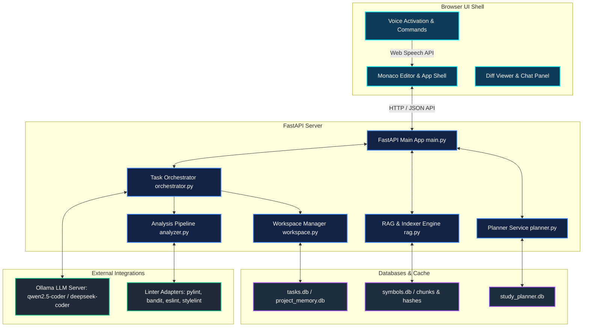
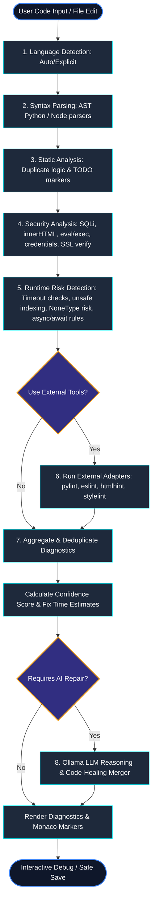
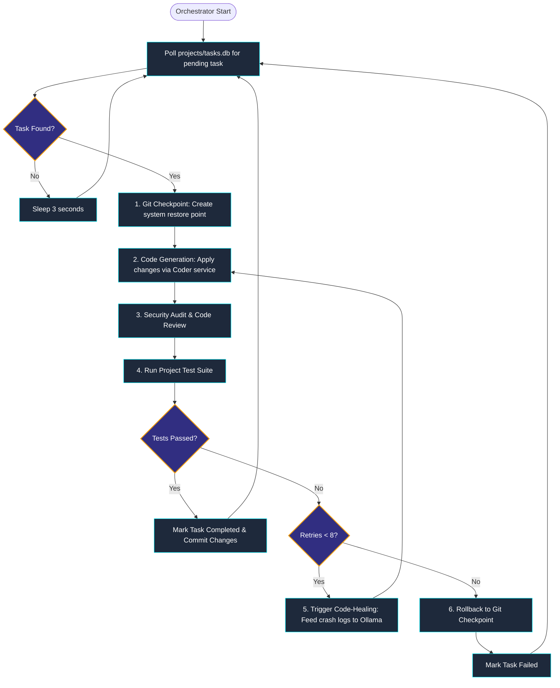

# 🛡️ AVATAR — Autonomous AI Engineering IDE

AVATAR is a premium, local-first AI software engineering assistant and autonomous IDE designed for pasted-code review, runtime-risk detection, automated code healing, interactive debugging, git checkpoints, and continuous browser voice activation.

---

## 📌 Architecture & Design

AVATAR is structured to run locally on your system, linking a fast FastAPI backend, SQLite persistent stores, external syntax/styling linters, and local LLM services (Ollama) to form a robust development sandbox.

### 1. High-Level Component Architecture
The diagram below shows how the browser UI shell communicates with the FastAPI service layers, databases, and local/external tools.



---

## 🛠️ Layered Code Analysis Pipeline

AVATAR utilizes a unique multi-stage pipeline to inspect submitted code. The pipeline operates sequentially: from lightweight AST syntax parsing to deep local security audits, before integrating external code-quality adapters and LLM reasoning.



### Analysis Pipeline Stages
1. **Language Detection**: Resolves incoming code languages (Python, JS, TS, HTML, CSS, JSON, YAML) dynamically or via user override.
2. **Syntax Parsing**: Parses code into an Abstract Syntax Tree (AST) for Python, or triggers node-based parsers for structural integrity validation.
3. **Static Analysis**: Identifies duplicate implementation blocks and pending tasks (TODO/FIXME indicators).
4. **Security Audits**: Scans using regex models for common threat patterns like `eval()`, `exec()`, direct `innerHTML` assignments, plain-text credentials, SQL injection, and disabled TLS cert verification (`verify=False`).
5. **Runtime Risk Audits**: Custom diagnostics search for dangerous non-timeout requests, unhandled `.json()` response parses, possible `NoneType` attribute accesses, unguarded list indices, and out-of-scope `await` expressions.
6. **External Tool Adapters**: Automatically triggers environment-ready code linting tools (e.g. `pylint`, `eslint`, `bandit`) for professional grade checking.
7. **Ollama LLM Merge**: Merges AST metrics and local lint warnings to guide streaming repair algorithms.

---

## 🔄 Autonomous Task Orchestration & Code-Healing

When running in **Autonomous Mode**, the backend processes a queue of orchestration tasks. If unit tests fail, it launches an automatic loop of debugging and healing.



---

## 📂 Project Structure

Below is an overview of the directories and key service modules powering AVATAR:

```text
.
├── app/
│   ├── main.py                     # FastAPI main routes, stream generation, & project APIs
│   ├── orchestrator.py             # Asynchronous task graph processor & execution loop
│   ├── planner.py                  # Study planner SQLite routes (/api/planner/tasks)
│   ├── schemas.py                  # Pydantic schemas for chat, reviews, and saves
│   └── services/
│       ├── analyzer.py             # Layered syntax, static, security, & runtime analyzer
│       ├── diagnostics.py          # Diagnostic data models, severities, and fix-time metrics
│       ├── language.py             # File extension detector and Monaco language mapper
│       ├── tooling.py              # Subprocess wrappers for pylint, pyflakes, eslint, htmlhint, etc.
│       ├── ollama.py               # Ollama helper logic and model fetching endpoints
│       ├── coder.py                # Generates and patches file modifications
│       ├── debugger.py             # Debugs exception traces and suggests edits
│       ├── reviewer.py             # Code reviewer service for assessing pull requests
│       ├── git_manager.py          # Git repository creation, commits, checkpoints, & rollbacks
│       ├── tester.py               # Spawns sub-processes to execute unit test frameworks
│       ├── project_runner.py       # Full system test runner and task ETA estimator
│       ├── workspace.py            # Workspace manager controlling read/write modes and history
│       ├── file_manager.py         # Secure file input/output logic with relative path locks
│       ├── rag.py                  # Text chunking, SQLite caching, & keyword semantic RAG
│       ├── repository_analyzer.py  # AST-based symbol extractor mapping project classes & defs
│       ├── memory.py               # Persistent metadata database (requirements, execution plans)
│       ├── intent_classifier.py    # Classifies user prompts (e.g. documentation vs coding intent)
│       ├── task_manager.py         # SQLite-backed task statuses, ETAs, and progress monitors
│       └── security.py             # Audits code diff modifications for regression risks
├── static/
│   ├── index.html                  # Dashboard UI (Monaco Editor, tree navigator, audio waveform)
│   ├── styles.css                  # Modern dark-mode theme, glassmorphism, & animations
│   └── app.js                      # UI logic, Monaco settings, WebSocket/HTTP client, voice commands
├── projects/                       # Local sandboxed workspace for custom code editing
├── requirements.txt                # Python backend dependencies
├── package.json                    # JavaScript static tools, style linting dependencies
├── run_app.bat                     # Starts the FastAPI application locally
├── stop_app.bat                    # Safe port-8000 processes cleanup script
├── run_exe.py                      # Desktop runner wrapping the IDE inside a pywebview frame
└── run_test_heal.bat               # Interactive test demonstrating automated code-healing
```

---

## 💻 Technologies & Languages

### Languages Used
* **Backend**: Python 3.11+
* **Frontend**: HTML5, Vanilla CSS3 (custom CSS tokens), modern ES6+ Javascript

### Core Libraries & Technical Ecosystem

#### 🐍 Python Requirements (from requirements.txt)
* **FastAPI** (`0.115.6`): High-performance web framework for APIs and web page routing.
* **Uvicorn** (`0.34.0`): Asynchronous Server Gateway Interface (ASGI) server.
* **Httpx** (`0.28.1`): Next-generation HTTP client for querying Ollama and external APIs.
* **Pydantic** (`2.10.4`): Strict schema definitions and validation structures.
* **Pylint** (`3.3.3`) / **Pyflakes** (`3.2.0`): Static code quality analysis and syntax inspection.
* **Bandit** (`1.8.0`): Security vulnerabilities auditing.
* **SpeechRecognition**: Voice capture integration from system microphone input.
* **Pywebview**: Renders native UI frames running the FastAPI server.
* **Winsdk**: Windows OS integration utilities.
* **Pyperclip**, **Pyautogui**, **Pygetwindow**: Host clipboard interaction, window tracking, and OS automation.

#### 📦 Node.js DevDependencies (from package.json)
* **ESLint** (`^9.18.0`): JavaScript coding standard checker.
* **Stylelint** (`^16.12.0`): CSS syntax and rules validation.
* **HTMLHint** (`^1.1.4`): HTML validation engine.
* **Vite** (`^5.0.0`): Dev server and asset build system.

---

## 🚀 Installation Process

### Prerequisites
1. **Python 3.11+** installed on your system.
2. **Node.js 18+** (Optional, required if you want local JS/CSS/HTML linter diagnostics).
3. **Ollama** installed on your computer.

### Step 1: Set Up Ollama
1. Download and install Ollama from [ollama.com](https://ollama.com).
2. Launch Ollama in the background.
3. Pull a supported code reasoning model:
   ```powershell
   ollama pull qwen2.5-coder
   ```
   > [!TIP]
   > You can also pull other models such as `deepseek-coder` or `codellama`, which AVATAR can interact with.

### Step 2: Backend Setup
1. Clone the project repository and open your shell in the root directory.
2. Create and activate a Python virtual environment:
   ```powershell
   python -m venv .venv
   .venv\Scripts\activate
   ```
3. Install the required Python packages:
   ```powershell
   pip install -r requirements.txt
   ```

### Step 3: Frontend Linter Setup (Optional)
If you wish to enable inline HTML, CSS, and JS diagnostics:
```powershell
npm install
```

---

## 🏃 Running the Application

There are multiple ways to execute the AVATAR application suite:

### Option A: Standard Browser Web Mode
To launch the FastAPI server directly, execute the provided batch helper:
```powershell
.\run_app.bat
```
* Or run it manually via python:
  ```powershell
  uvicorn app.main:app --host 127.0.0.1 --port 8000 --reload
  ```
* Open your browser and navigate to: `http://127.0.0.1:8000`

### Option B: Native Desktop App Mode
To run AVATAR as a standalone native window (using `pywebview` instead of loading inside a browser tab):
```powershell
python run_exe.py
```

### Option C: Stopping the Server
To release port `8000` and kill running server processes:
```powershell
.\stop_app.bat
```

---

## 🧪 Demonstration & Automated Code Healing

AVATAR has built-in endpoints to catch program crashes, analyze tracebacks, suggest edits, and apply repairs automatically.

### Running a Code-Healing Demo
1. Start the AVATAR server (Option A or B above).
2. Run the healing demonstration batch script:
   ```powershell
   .\run_test_heal.bat
   ```
3. **How it works**:
   * The script attempts to run a deliberately broken file (`projects/test_heal.py`).
   * When execution fails, the batch script intercepts the error and makes a `POST` request to `http://127.0.0.1:8000/api/report_error`.
   * AVATAR's backend receives the traceback, queries your local Ollama instance for a corrected version, applies the healed code back to the file, and runs the script successfully.

---

## 📝 Key Features & Usage Notes

* **Execution Modes**:
  * **🟢 Autonomous**: Allowing the AI to write, run, and self-heal files directly.
  * **🟡 Review**: The AI compiles edits, but asks for explicit authorization before committing.
  * **🔴 Read-Only**: Disables file edits, serving as an audit console.
* **Workspace Safety**: Reads, writes, and modifications are confined inside the `projects/` sub-directory.
* **Monaco Editor CDN**: The Monaco editor requires internet access on initial browser load to download essential styling and editor files from the CDN.
* **RAG Search**: Using `Alt+K` or the search omnibox, you can perform semantic keyword indexing across all workspace files stored inside `projects/`.
